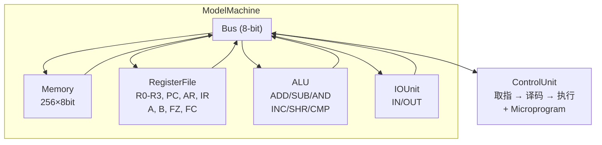
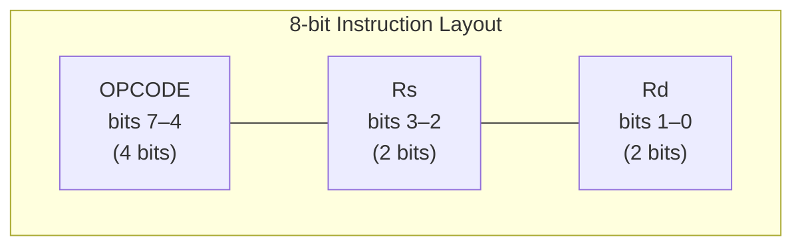
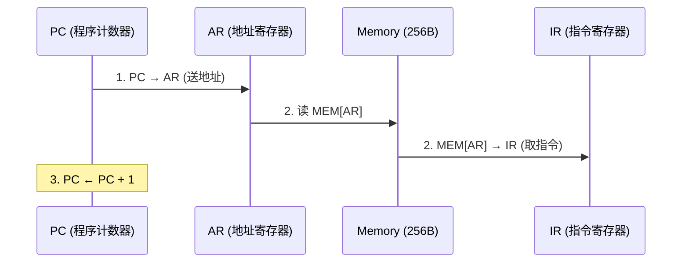
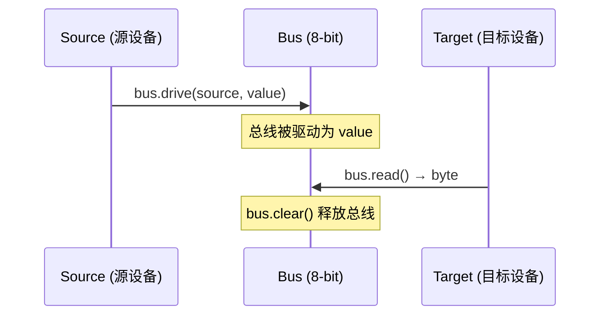
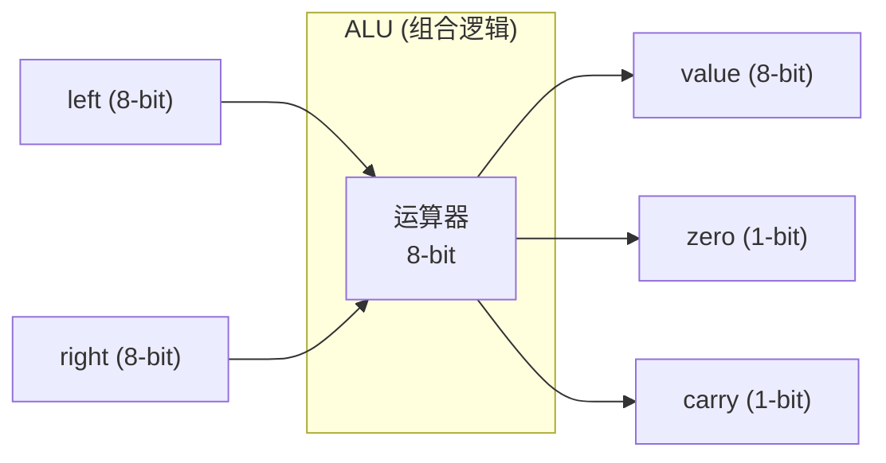

# 复杂模型机模拟器 — 原理分析与使用手册

## 一、项目概述

本项目是一个**复杂模型机（Complex Model Machine）模拟器**，用 Python 实现了一个完整的 8 位教学 CPU 模拟环境。它模拟了一台具有微程序控制能力的模型计算机，常用于大学计算机组成原理课程的实验教学。

### 核心特性

- **8 位数据总线**，256 字节内存空间
- **4 个通用寄存器**（R0–R3）+ 专用寄存器（PC、AR、IR、A、B、FZ、FC）
- **16 条机器指令**，覆盖算术运算、逻辑运算、数据传送、I/O、分支跳转
- **双模式运行**：硬布线模式（默认）和微程序模式
- **CLI 和 GUI 双界面**：命令行适合批处理和调试，Tkinter 图形界面适合交互式实验
- 支持程序文件加载、输入注入、指令追踪（trace）、内存 dump

---

## 二、系统架构

### 2.1 总体结构



### 2.2 组件详解

| 模块 | 文件 | 职责 |
|------|------|------|
| **ALU** | `model_machine/alu.py` | 算术逻辑单元：ADD、SUB、AND、INC、SHR、CMP，同时计算零标志(FZ)和进位/借位标志(FC) |
| **RegisterFile** | `model_machine/registers.py` | 寄存器文件：4个通用寄存器(R0-R3) + PC/AR/IR/A/B/FZ/FC |
| **Memory** | `model_machine/memory.py` | 256 字节主存，支持读写和范围 dump |
| **Bus** | `model_machine/bus.py` | 8 位数据总线，连接所有组件，所有数据传送都经过总线 |
| **ControlUnit** | `model_machine/control_unit.py` | 控制单元：取指→译码→执行的循环，是 CPU 的核心 |
| **IOUnit** | `model_machine/io_unit.py` | 输入输出单元：管理 IN/OUT 端口操作，支持队列式输入 |
| **Loader** | `model_machine/loader.py` | 程序加载器：解析机器程序(`$P`)和微程序(`$M`)文本文件 |
| **Machine** | `model_machine/machine.py` | 顶层装配器：将所有组件组装成完整的模型机 |
| **Simulation** | `model_machine/simulation.py` | 仿真运行器：加载程序→运行→格式化输出结果 |
| **GUI** | `model_machine/gui.py` | Tkinter 图形界面 |

---

## 三、指令集详解

### 3.1 指令格式

每条指令占 1 字节（8 位），格式为 `OOOO D DSS`：



- **高 4 位** (bits 7–4)：操作码，决定指令类型
- **bits 3–2**：源寄存器编号 (Rs)
- **bits 1–0**：目标寄存器编号 (Rd)
- 需要操作数的指令（如 LDI、JMP、STA 等）会在指令后紧跟 1 字节操作数

### 3.2 完整指令表

| 操作码 | 助记符 | 格式 | 功能 | 影响标志 | 备注 |
|--------|--------|------|------|----------|------|
| `0x0_` | ADD | `ADD Rd,Rs` | Rd ← Rd + Rs | FZ, FC | |
| `0x1_` | AND | `AND Rd,Rs` | Rd ← Rd & Rs | FZ, FC=0 | |
| `0x2_` | IN | `IN Rd,port` | Rd ← IO[port] | — | 从输入端口读取 |
| `0x3_` | OUT | `OUT port,Rs` | IO[port] ← Rs | — | 向输出端口写入 |
| `0x4_` | MOV | `MOV Rd,Rs` | Rd ← Rs | — | **仅微程序模式** |
| `0x50` | HLT | `HLT` | 停机 | — | 固定编码 0x50 |
| `0x6_` | LDI | `LDI Rd,imm` | Rd ← imm | — | 加载立即数 |
| `0x7_` | INC | `INC Rd` | Rd ← Rd + 1 | FZ, FC | |
| `0x8_` | SUB | `SUB Rd,Rs` | Rd ← Rd - Rs | FZ, FC | FC=借位 |
| `0xA_` | SHR | `SHR Rd` | Rd ← Rd >> 1 | FZ, FC=LSB | **仅微程序模式** |
| `0xB_` | CMP | `CMP Rd,Rs` | Rd - Rs（不写回） | FZ, FC | **仅微程序模式** |
| `0xB_/0xE_` | JMP | `JMP addr` | PC ← addr | — | 无条件跳转 |
| `0xC_` | LAD | 见下 | Rd ← MEM[addr] | — | 加载内存数据 |
| `0xD_` | STA | 见下 | MEM[addr] ← Rd | — | 存储到内存 |
| `0xF_` | BZC | `BZC addr` | if FZ or FC: PC←addr | — | 条件跳转 |

**LAD/STA 的模式差异**：
- **硬布线模式**：`LAD Rd,[Rs],offset` — 地址 = Rs + offset（变址寻址）；`STA addr,Rd` — 直接地址
- **微程序模式**：`LAD Rd,addr` — 直接地址寻址；`STA Rd,addr` — 直接地址（参数顺序与硬布线不同）

### 3.3 标志位

| 标志 | 含义 | 说明 |
|------|------|------|
| **FZ** (Zero) | 零标志 | ALU 结果为 0 时置 1 |
| **FC** (Carry) | 进位/借位标志 | ADD/INC 溢出时置 1，SUB 借位时置 1，SHR 保存移出的最低位 |

**BZC 条件跳转**：当 FZ=1 **或** FC=1 时发生跳转（即"为零或有进位/借位则跳转"）。

---

## 四、指令执行流程（CPU 微架构）

每条指令的执行分为以下阶段：

### 4.1 取指阶段（Fetch）



### 4.2 译码与执行阶段（Decode & Execute）

根据 IR 中的操作码分组执行：

```mermaid
flowchart TD
    IR["IR[7:4] 操作码译码"]
    IR --> ADD["0x0: ADD<br/>A←Rd, B←Rs<br/>ALU加法 → Rd<br/>更新 FZ/FC"]
    IR --> AND["0x1: AND<br/>A←Rd, B←Rs<br/>ALU按位与 → Rd<br/>更新 FZ/FC"]
    IR --> IN["0x2: IN<br/>取操作数(端口)<br/>IO读 → Rd"]
    IR --> OUT["0x3: OUT<br/>取操作数(端口)<br/>Rs → IO写"]
    IR --> MOV["0x4: MOV (微程序)<br/>Rs → Rd"]
    IR --> HLT["0x5: HLT<br/>停机"]
    IR --> LDI["0x6: LDI<br/>取操作数(imm)<br/>imm → Rd"]
    IR --> INC["0x7: INC<br/>A←Rd, ALU加1<br/>结果 → Rd, 更新FZ/FC"]
    IR --> SUB["0x8: SUB<br/>A←Rd, B←Rs<br/>ALU减法 → Rd<br/>更新 FZ/FC"]
    IR --> SHR["0xA: SHR (微程序)<br/>A←Rd, ALU右移<br/>结果 → Rd, 更新FZ/FC"]
    IR --> JMP_CMP["0xB: JMP/CMP<br/>微程序→CMP<br/>硬布线→JMP"]
    IR --> LAD["0xC: LAD<br/>取操作数, 计算地址<br/>MEM读 → Rd"]
    IR --> STA["0xD: STA<br/>取操作数(地址)<br/>Rd → MEM写"]
    IR --> JMP["0xE: JMP<br/>取操作数(addr)<br/>addr → PC"]
    IR --> BZC["0xF: BZC<br/>取操作数<br/>if FZ|FC: addr→PC"]
```



### 4.3 数据传送机制

所有寄存器之间的数据传送都经过**总线（Bus）**，采用 `_transfer()` 方法：



```python
def _transfer(source, target, value):
    bus.drive(source, value)   # 源设备驱动总线
    byte = bus.read()          # 目标设备从总线读取
    bus.clear()                # 释放总线
    return byte
```

这精确模拟了真实 CPU 中总线分时复用的机制。

---

## 五、微程序模式

### 5.1 工作原理

当加载了微程序文件后，控制单元进入**微程序模式**。此时指令集发生变化：

| 新增指令 | 变更/移除 |
|----------|----------|
| `MOV Rd,Rs` (0x4_) | — |
| `SHR Rd` (0xA_) | — |
| `CMP Rd,Rs` (0xB_) | JMP 的 0xB_ 编码被取代，JMP 仅保留 0xE_ |
| LAD 变为直接寻址 | LAD 不再使用变址寻址 |

微程序本身以 24 位控制字的形式存储在 `microprogram` 字典中，每条微指令控制数据通路中的具体操作（如寄存器选择、ALU 运算选择、总线传输等）。

### 5.2 微程序文件格式

```
$M 00 000001    ; NOP, 地址 00H, 控制字 000001H
$M 01 006D43    ; PC->AR, PC+1
$M 03 107070    ; MEM->IR, P<1>
```

每条 `$M` 记录包含：
- **地址** (8 位)：微程序存储器地址
- **控制字** (24 位)：微指令编码，控制各组件的数据通路

---

## 六、ALU 设计

ALU 是一个**组合逻辑**单元（无状态），接收输入产生输出：



**支持的运算**：`add` / `sub` / `and` / `inc` / `shr` / `compare`

- **add**: `(left + right) & 0xFF`，溢出时 carry=1
- **sub**: `(left - right) & 0xFF`，借位时 carry=1  
- **and**: `left & right`，carry 始终为 0
- **inc**: `(value + 1) & 0xFF`，溢出时 carry=1
- **shr**: `value >> 1`，carry = 原 LSB
- **compare**: 与 sub 相同但结果不写回寄存器（FZ, FC 通过控制单元单独处理）

---

## 七、I/O 系统

### 7.1 输入（IN）

输入值可以来自：
1. **命令行参数** (`--input`)：以队列形式注入，IN 指令按顺序消费
2. **输入端口映射** (`input_ports`)：当队列为空时，从预定义的端口读取默认值

### 7.2 输出（OUT）

每次 OUT 指令产生一个 `IOEvent` 记录（端口号 + 值）。**默认行为**：一旦产生任何输出，仿真即停止（`stop_on_output=True`），这在教学场景中便于观察单次计算结果。

---

## 八、程序文件格式

### 8.1 机器程序（`$P` 记录）

```
; 注释以分号开头
$P 00 20      ; 地址 00H 写入 20H (IN R0,00H)
$P 01 00      ; 地址 01H 写入 00H (端口号操作数)
00 60         ; 也支持无 $P 前缀的纯地址-值格式
01 0F
```

每条记录：**地址 (8bit) + 值 (8bit)**，支持多种数值格式：
- 十六进制：`70H`, `0x70`, `70`
- 二进制：`01110000`（8位）, `0b01110000`

### 8.2 微程序（`$M` 记录）

```
$M 00 000001   ; 地址 00H, 控制字 000001H
$M 1A 05B201   ; 地址 1AH, 控制字 05B201H
```

每条记录：**地址 (8bit) + 控制字 (24bit)**。

### 8.3 混合文件

同一文件可同时包含 `$P` 和 `$M` 记录，加载器会自动区分：
- 程序加载器忽略 `$M` 行
- 微程序加载器忽略 `$P` 行

---

## 九、使用方法

### 9.1 命令行（CLI）

**运行示例程序（1+2+...+X）**：

```bash
# 输入 05，启用指令追踪
python3 main.py programs/sum_1_to_x.txt --input 05 --trace

# 输入 0F（15），计算 1+2+...+15 = 120 = 78H
python3 main.py programs/sum_1_to_x.txt --input 0F
```

**使用独立微程序**：

```bash
python3 main.py examples/machine\ program.txt \
    --microprogram examples/microprogram.txt \
    --input 05,03 --trace
```

**内存 dump**：

```bash
python3 main.py programs/sum_1_to_x.txt --input 05 --dump 60:70
```

**完整参数列表**：

| 参数 | 说明 |
|------|------|
| `program` | 机器程序文件路径 |
| `--microprogram` | 微程序文件路径 |
| `--input` | 输入字节（可逗号分隔或多次指定） |
| `--trace` | 打印每条指令的微操作追踪 |
| `--dump START:END` | 执行后 dump 指定内存范围 |
| `--max-steps N` | 最大执行指令数（默认 10000） |
| `--gui` | 启动 Tkinter 图形界面 |

### 9.2 图形界面（GUI）

```bash
# 方式一：直接启动 GUI
python3 gui.py

# 方式二：通过 main.py
python3 main.py --gui
```

GUI 提供：
- 机器程序/微程序文件选择（Browse 按钮）
- 输入字节、最大步数、Dump 范围配置
- Trace 开关
- Run / Clear 按钮
- 等宽字体输出区域（带滚动条）

### 9.3 作为 Python 库使用

```python
from model_machine.machine import ModelMachine
from model_machine.loader import parse_program_text

# 创建机器实例
machine = ModelMachine(input_values=[0x05])

# 加载程序
records = parse_program_text("""
    00 20
    01 00
    02 61
    03 0F
    04 14
    05 70
    06 04
    07 D0
    08 70
    09 34
    0A 40
    0B 50
""")
machine.load_records(records)

# 运行
result = machine.run(max_steps=1000, stop_on_output=True)

# 查看结果
print(f"原因: {result.reason}, 步数: {result.steps}")
print(f"R0 = {machine.registers.get_reg(0):02X}")
print(f"OUT = {machine.io.outputs[-1].value:02X}")
```

---

## 十、测试

项目包含完整的单元测试（`tests/` 目录）：

```bash
# 运行所有测试
python3 -m pytest tests/ -v

# 或使用 unittest
python3 -m unittest discover tests/ -v
```

| 测试文件 | 覆盖内容 |
|----------|----------|
| `test_alu.py` | ALU 各运算功能的正确性 |
| `test_loader.py` | 程序/微程序解析、多进制格式、错误处理 |
| `test_control_unit.py` | 指令执行正确性、微程序模式、示例程序验证 |
| `test_simulation.py` | 端到端仿真流程、输入解析、输出格式化 |

---

## 十一、示例程序

### 11.1 求和程序（`programs/sum_1_to_x.txt`）

读取输入 X，计算 `1+2+...+X`，结果存入 70H 并输出。使用预先存储在 60H–6EH 的查找表（1–15），通过变址寻址 `LAD R3,[R2],00H` 累加。

### 11.2 组合数程序（`program.txt`）

计算组合数 C(n, k)。输入格式：高 4 位为 n，低 4 位为 k。通过重复加法和减法实现乘法和除法，支持 16 位中间结果。

### 11.3 微程序示例（`examples/`）

展示微程序模式下 `LAD` 直接寻址、`MOV`、`SHR`、`CMP` 等扩展指令的使用。

---

## 十二、设计亮点

1. **精确的微架构模拟**：每个寄存器传输都经过总线（Bus），真实反映 CPU 数据通路
2. **双模式指令集**：硬布线和微程序两种模式共享同一控制单元，通过 `microprogram` 字典是否为空来切换
3. **指令追踪（Trace）**：每条指令记录微操作序列、寄存器变化、内存写入、I/O 输出，便于调试和教学
4. **灵活的输入格式**：支持十六进制（`70H`/`0x70`）、二进制（`01110000`）、十进制等多种数值表示
5. **混合程序文件**：同一文件可混用 `$P`/`$M` 记录，程序加载器和微程序加载器各取所需
6. **完整的测试覆盖**：从 ALU 单元测试到端到端仿真测试

---

## 十三、项目文件结构

```
jizushiyan/
├── main.py                  # CLI 入口
├── gui.py                   # GUI 快捷入口
├── program.txt              # 组合数计算示例程序
├── README.md                # 简要说明
├── ANALYSIS.md              # 本文档
├── programs/
│   └── sum_1_to_x.txt       # 求和示例程序
├── examples/
│   ├── machine program.txt  # 微程序模式示例（机器程序）
│   └── microprogram.txt     # 微程序模式示例（微程序）
├── model_machine/
│   ├── __init__.py          # 包导出
│   ├── alu.py               # 算术逻辑单元
│   ├── registers.py         # 寄存器文件
│   ├── memory.py            # 256B 内存
│   ├── bus.py               # 8 位数据总线
│   ├── control_unit.py      # 控制单元（取指/译码/执行）
│   ├── io_unit.py           # I/O 单元
│   ├── loader.py            # 程序/微程序加载器
│   ├── machine.py           # 顶层机器装配
│   ├── simulation.py        # 仿真运行与输出格式化
│   └── gui.py               # Tkinter GUI
└── tests/
    ├── test_alu.py           # ALU 测试
    ├── test_loader.py        # 加载器测试
    ├── test_control_unit.py  # 控制单元测试
    └── test_simulation.py    # 仿真测试
```
